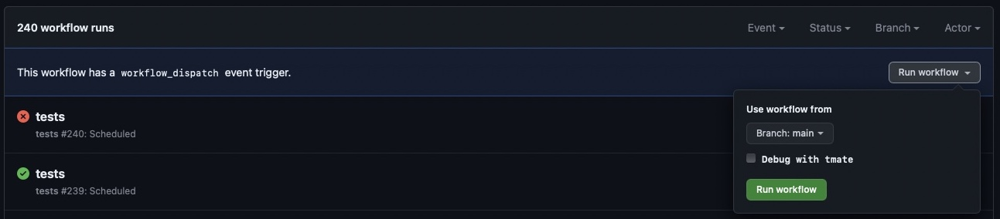

[](https://github.com/ddev/ddev-ddev-vite/actions/workflows/tests.yml) 

# ddev-vite <!-- omit in toc -->

- [What is ddev-vite?](#what-is-ddev-vite)
- [Components of the repository](#components-of-the-repository)
- [Getting started](#getting-started)
  - [Automatically start ViteJs](#automatically-start-vitejs)
- [How to debug tests (Github Actions)](#how-to-debug-tests-github-actions)

## What is ddev-vite?

[ViteJs](https://vitejs.dev/) is a modern bundler, designed to be fast.

This add-on is a low-config option that exposes Vite's default port from DDEV so you can view the page in your browser.
It is based on the article [Working with Vite in DDEV - an introduction](https://ddev.com/blog/working-with-vite-in-ddev/), by Matthias Andrasch.
Developers are responsible for installing, maintaining, and running the Vite server. This add-on only exposes the port.

For a full-featured Vite DDEV addon, please use the excellent [torenware/ddev-viteserve](https://github.com/torenware/ddev-viteserve) add-on.

## Components of the repository

- [config.vite.yaml](config.vite.yaml): configure DDEV to expose the port.
- [install.yaml](install.yaml): describes how to install the service or other component.
- [test.bats](tests/test.bats): test suite to confirm add-on continues to work as expected.
- [Github actions setup](.github/workflows/tests.yml): automates daily tests and on pull requests.

## Getting started

This add-on assumes the developer has:

- Installed ViteJs via their preferred package manager.
- A valid ViteJS configuration file is present in the project root.

1. Install the add-on and restart DDEV

```shell
ddev get tyler36/ddev-vite
ddev restart
```

1. Update `vite.config.js`

```js
const port = 5173;
const origin = `${process.env.DDEV_PRIMARY_URL}:${port}`;

export default defineConfig({
    ...
    // Adjust Vites dev server for DDEV: https://vitejs.dev/config/server-options.html
    server: {
        host: '0.0.0.0',
        port: port,
        origin: origin,
        strictPort: true
    },
});
```

1. Start Vite inside the container.

```shell
ddev npn run dev
```

### Automatically start ViteJs

To automatically start the ViteJs server, update DDEV `post-start` hook in `.ddev/config.yaml`.
For example:

```yaml
hooks:
  post-start:
    - exec: npm run dev
```

## How to debug tests (Github Actions)

1. You need an SSH-key registered with GitHub. You either pick the key you have already used with `github.com` or you create a dedicated new one with `ssh-keygen -t ed25519 -a 64 -f tmate_ed25519 -C "$(date +'%d-%m-%Y')"` and add it at `https://github.com/settings/keys`.

2. Add the following snippet to `~/.ssh/config`:

```
Host *.tmate.io
    User git
    AddKeysToAgent yes
    UseKeychain yes
    PreferredAuthentications publickey
    IdentitiesOnly yes
    IdentityFile ~/.ssh/tmate_ed25519
```

3. Go to `https://github.com/<user>/<repo>/actions/workflows/tests.yml`.

4. Click the `Run workflow` button and you will have the option to select the branch to run the workflow from and activate `tmate` by checking the `Debug with tmate` checkbox for this run.



5. After the `workflow_dispatch` event was triggered, click the `All workflows` link in the sidebar and then click the `tests` action in progress workflow.

7. Pick one of the jobs in progress in the sidebar.

8. Wait until the current task list reaches the `tmate debugging session` section and the output shows something like:

```
106 SSH: ssh PRbaS7SLVxbXImhjUqydQBgDL@nyc1.tmate.io
107 or: ssh -i <path-to-private-SSH-key> PRbaS7SLVxbXImhjUqydQBgDL@nyc1.tmate.io
108 SSH: ssh PRbaS7SLVxbXImhjUqydQBgDL@nyc1.tmate.io
109 or: ssh -i <path-to-private-SSH-key> PRbaS7SLVxbXImhjUqydQBgDL@nyc1.tmate.io
```

9. Copy and execute the first option `ssh PRbaS7SLVxbXImhjUqydQBgDL@nyc1.tmate.io` in the terminal and continue by pressing either <kbd>q</kbd> or <kbd>Ctrl</kbd> + <kbd>c</kbd>.

10. Start the Bats test with `bats ./tests/test.bats`.

For a more detailed documentation about `tmate` see [Debug your GitHub Actions by using tmate](https://mxschmitt.github.io/action-tmate/).

**Contributed and maintained by [@tyler36](https://github.com/tyler36)**
